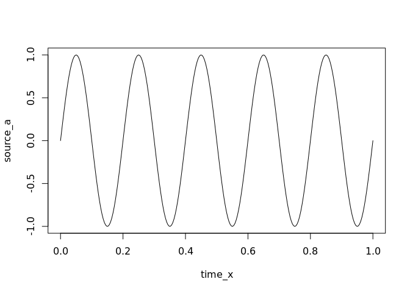
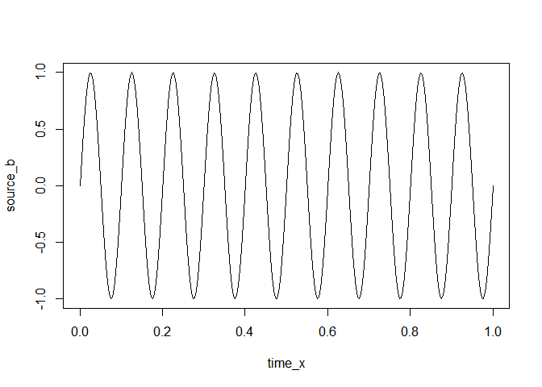
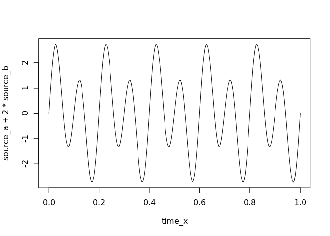
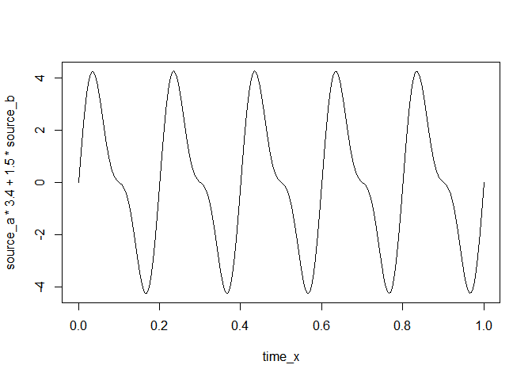
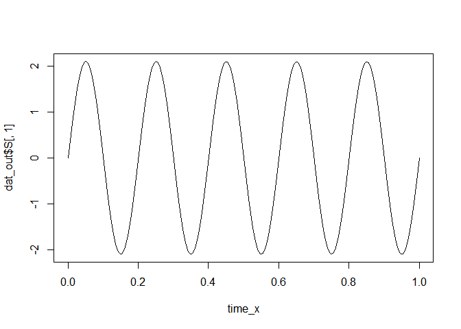

<!-- README.md is generated from README.Rmd. Please edit that file -->

# infomax

<!-- badges: start -->

[](https://codecov.io/gh/craddm/infomax?branch=master)
<!-- badges: end -->

The `infomax` package is an R implementation of the Infomax and Extended
Infomax algorithms (Bell & Sejnowski, 1995; Makeig, Bell, Jung, &
Sejnowski, 1996) for Independent Component Analysis.

## Installation

The package is not currently released on
[CRAN](https://CRAN.R-project.org).

You can install the development version from
[GitHub](https://github.com/) with:

``` r
# install.packages("devtools")
devtools::install_github("craddm/infomax")
```

## Example

This is a basic example which shows you how to solve a common problem:

``` r
library(infomax)
## basic example code
```

``` r
time_x <- seq(0, 1, by = 1/256)
source_a <- sin(2 * pi * 5 * time_x)
source_b <- sin(2 * pi * 10 * time_x)
plot(time_x, source_a, type = "l")
```



``` r
plot(time_x, source_b, type = "l")
```



``` r
plot(time_x, source_a + 2 * source_b, type = "l")
```



``` r
plot(time_x, source_a * 3.4 + 1.5 * source_b, type = "l")
```

 The
function returns the estimated mixing matrix, unmixing matrix, and
unmixed source timecourses.

``` r
mixed_data <- matrix(NA,
                     nrow = length(time_x),
                     ncol = 2)
mixed_data[, 1] <- source_a + 2 * source_b
mixed_data[, 2] <- source_a * 3.4 + 1.5 * source_b
dat_out <- run_infomax(mixed_data, whiten = "PCA")
#> Step: 1, lrate: 0.007213, wchange: 0.38324052, angledelta:  0.0
#> Step: 2, lrate: 0.007213, wchange: 0.25253517, angledelta:  0.0
#> Step: 3, lrate: 0.007213, wchange: 0.09809079, angledelta: 102.1
#> Step: 4, lrate: 0.007069, wchange: 0.04330047, angledelta: 66.5
#> Step: 5, lrate: 0.006928, wchange: 0.03084987, angledelta: 117.2
#> Step: 6, lrate: 0.006789, wchange: 0.03029123, angledelta: 125.9
#> Step: 7, lrate: 0.006653, wchange: 0.02563884, angledelta: 160.8
#> Step: 8, lrate: 0.006520, wchange: 0.00510844, angledelta: 163.2
#> Step: 9, lrate: 0.006390, wchange: 0.00059489, angledelta: 134.9
#> Step: 10, lrate: 0.006262, wchange: 0.00696743, angledelta: 44.0
#> Step: 11, lrate: 0.006262, wchange: 0.00633961, angledelta: 74.0
#> Step: 12, lrate: 0.006137, wchange: 0.01499245, angledelta: 92.2
#> Step: 13, lrate: 0.006014, wchange: 0.00691107, angledelta: 145.9
#> Step: 14, lrate: 0.005894, wchange: 0.01419186, angledelta: 129.1
#> Step: 15, lrate: 0.005776, wchange: 0.00983892, angledelta: 161.8
#> Step: 16, lrate: 0.005661, wchange: 0.00168692, angledelta: 128.3
#> Step: 17, lrate: 0.005547, wchange: 0.00165376, angledelta: 66.4
#> Step: 18, lrate: 0.005436, wchange: 0.00056595, angledelta: 103.4
#> Step: 19, lrate: 0.005328, wchange: 0.00254645, angledelta: 30.6
#> Step: 20, lrate: 0.005328, wchange: 0.00642621, angledelta: 136.2
#> Step: 21, lrate: 0.005221, wchange: 0.01422516, angledelta: 137.1
#> Step: 22, lrate: 0.005117, wchange: 0.00495641, angledelta: 162.2
#> Step: 23, lrate: 0.005014, wchange: 0.00882255, angledelta: 146.5
#> Step: 24, lrate: 0.004914, wchange: 0.00391004, angledelta: 139.4
#> Step: 25, lrate: 0.004816, wchange: 0.00418703, angledelta: 104.6
#> Step: 26, lrate: 0.004719, wchange: 0.00089703, angledelta: 89.2
#> Step: 27, lrate: 0.004625, wchange: 0.00543303, angledelta: 154.0
#> Step: 28, lrate: 0.004533, wchange: 0.01925850, angledelta: 156.5
#> Step: 29, lrate: 0.004442, wchange: 0.02191376, angledelta: 157.3
#> Step: 30, lrate: 0.004353, wchange: 0.00977360, angledelta: 148.9
#> Step: 31, lrate: 0.004266, wchange: 0.01384598, angledelta: 125.0
#> Step: 32, lrate: 0.004181, wchange: 0.00468608, angledelta: 115.4
#> Step: 33, lrate: 0.004097, wchange: 0.00227562, angledelta: 52.9
#> Step: 34, lrate: 0.004097, wchange: 0.00280510, angledelta: 139.0
#> Step: 35, lrate: 0.004015, wchange: 0.00357901, angledelta: 153.0
#> Step: 36, lrate: 0.003935, wchange: 0.00113660, angledelta: 81.1
#> Step: 37, lrate: 0.003856, wchange: 0.00669071, angledelta: 117.4
#> Step: 38, lrate: 0.003779, wchange: 0.00897341, angledelta: 139.4
#> Step: 39, lrate: 0.003703, wchange: 0.00703752, angledelta: 167.6
#> Step: 40, lrate: 0.003629, wchange: 0.00450349, angledelta: 148.5
#> Step: 41, lrate: 0.003557, wchange: 0.00344120, angledelta: 139.5
#> Step: 42, lrate: 0.003486, wchange: 0.00512333, angledelta: 137.9
#> Step: 43, lrate: 0.003416, wchange: 0.00568290, angledelta: 147.3
#> Step: 44, lrate: 0.003348, wchange: 0.00323876, angledelta: 144.1
#> Step: 45, lrate: 0.003281, wchange: 0.00050277, angledelta: 86.4
#> Step: 46, lrate: 0.003215, wchange: 0.00091285, angledelta: 68.6
#> Step: 47, lrate: 0.003151, wchange: 0.00199715, angledelta: 73.7
#> Step: 48, lrate: 0.003088, wchange: 0.00328131, angledelta: 131.6
#> Step: 49, lrate: 0.003026, wchange: 0.00129768, angledelta: 119.4
#> Step: 50, lrate: 0.002965, wchange: 0.00065915, angledelta: 114.3
#> Step: 51, lrate: 0.002906, wchange: 0.00161698, angledelta: 141.5
#> Step: 52, lrate: 0.002848, wchange: 0.00096359, angledelta: 138.0
#> Step: 53, lrate: 0.002791, wchange: 0.00039161, angledelta: 109.1
#> Step: 54, lrate: 0.002735, wchange: 0.00077069, angledelta: 145.1
#> Step: 55, lrate: 0.002681, wchange: 0.00118532, angledelta: 58.1
#> Step: 56, lrate: 0.002681, wchange: 0.00032759, angledelta: 83.5
#> Step: 57, lrate: 0.002627, wchange: 0.00244534, angledelta: 78.4
#> Step: 58, lrate: 0.002574, wchange: 0.00106428, angledelta: 154.9
#> Step: 59, lrate: 0.002523, wchange: 0.00012587, angledelta: 104.1
#> Step: 60, lrate: 0.002472, wchange: 0.00116645, angledelta: 152.1
#> Step: 61, lrate: 0.002423, wchange: 0.00053750, angledelta: 109.8
#> Step: 62, lrate: 0.002375, wchange: 0.00339449, angledelta: 52.5
#> Step: 63, lrate: 0.002375, wchange: 0.00083205, angledelta: 139.3
#> Step: 64, lrate: 0.002327, wchange: 0.00253928, angledelta: 139.5
#> Step: 65, lrate: 0.002281, wchange: 0.00191383, angledelta: 151.4
#> Step: 66, lrate: 0.002235, wchange: 0.00166520, angledelta: 123.4
#> Step: 67, lrate: 0.002190, wchange: 0.00038222, angledelta: 119.4
#> Step: 68, lrate: 0.002146, wchange: 0.00037782, angledelta: 130.6
#> Step: 69, lrate: 0.002103, wchange: 0.00081093, angledelta: 76.7
#> Step: 70, lrate: 0.002061, wchange: 0.00052696, angledelta: 162.5
#> Step: 71, lrate: 0.002020, wchange: 0.00078812, angledelta: 22.9
#> Step: 72, lrate: 0.002020, wchange: 0.00077441, angledelta: 163.1
#> Step: 73, lrate: 0.001980, wchange: 0.00023361, angledelta: 92.5
#> Step: 74, lrate: 0.001940, wchange: 0.00136768, angledelta: 122.2
#> Step: 75, lrate: 0.001901, wchange: 0.00055560, angledelta: 139.4
#> Step: 76, lrate: 0.001863, wchange: 0.00134437, angledelta: 46.4
#> Step: 77, lrate: 0.001863, wchange: 0.00179219, angledelta: 120.3
#> Step: 78, lrate: 0.001826, wchange: 0.00212485, angledelta: 153.2
#> Step: 79, lrate: 0.001790, wchange: 0.00085506, angledelta: 114.3
#> Step: 80, lrate: 0.001754, wchange: 0.00009847, angledelta: 116.8
#> Step: 81, lrate: 0.001719, wchange: 0.00018696, angledelta: 104.1
#> Step: 82, lrate: 0.001684, wchange: 0.00086207, angledelta: 92.2
#> Step: 83, lrate: 0.001651, wchange: 0.00008862, angledelta: 70.4
#> Step: 84, lrate: 0.001618, wchange: 0.00014227, angledelta: 125.2
#> Step: 85, lrate: 0.001585, wchange: 0.00043853, angledelta: 53.2
#> Step: 86, lrate: 0.001585, wchange: 0.00045970, angledelta: 120.3
#> Step: 87, lrate: 0.001554, wchange: 0.00039297, angledelta: 143.6
#> Step: 88, lrate: 0.001522, wchange: 0.00002231, angledelta: 84.5
#> Step: 89, lrate: 0.001492, wchange: 0.00022969, angledelta: 151.0
#> Step: 90, lrate: 0.001462, wchange: 0.00059467, angledelta: 152.9
#> Step: 91, lrate: 0.001433, wchange: 0.00002917, angledelta: 79.1
#> Step: 92, lrate: 0.001404, wchange: 0.00037757, angledelta: 149.2
#> Step: 93, lrate: 0.001376, wchange: 0.00025903, angledelta: 111.9
#> Step: 94, lrate: 0.001349, wchange: 0.00005385, angledelta: 28.7
#> Step: 95, lrate: 0.001349, wchange: 0.00025074, angledelta: 160.4
#> Step: 96, lrate: 0.001322, wchange: 0.00014156, angledelta: 113.0
#> Step: 97, lrate: 0.001295, wchange: 0.00016154, angledelta: 142.2
#> Step: 98, lrate: 0.001269, wchange: 0.00038691, angledelta: 111.9
#> Step: 99, lrate: 0.001244, wchange: 0.00035365, angledelta: 153.5
#> Step: 100, lrate: 0.001219, wchange: 0.00001111, angledelta: 74.3
#> Step: 101, lrate: 0.001195, wchange: 0.00002526, angledelta: 107.6
#> Step: 102, lrate: 0.001171, wchange: 0.00027641, angledelta: 48.5
#> Step: 103, lrate: 0.001171, wchange: 0.00011244, angledelta: 126.4
#> Step: 104, lrate: 0.001147, wchange: 0.00001940, angledelta: 153.3
#> Step: 105, lrate: 0.001124, wchange: 0.00000701, angledelta: 105.0
#> Step: 106, lrate: 0.001102, wchange: 0.00004820, angledelta: 114.1
#> Step: 107, lrate: 0.001080, wchange: 0.00003810, angledelta: 72.1
#> Step: 108, lrate: 0.001058, wchange: 0.00003405, angledelta: 90.8
#> Step: 109, lrate: 0.001037, wchange: 0.00008686, angledelta: 96.6
#> Step: 110, lrate: 0.001016, wchange: 0.00002477, angledelta: 102.4
#> Step: 111, lrate: 0.000996, wchange: 0.00003517, angledelta: 111.6
#> Step: 112, lrate: 0.000976, wchange: 0.00012075, angledelta: 125.3
#> Step: 113, lrate: 0.000957, wchange: 0.00003088, angledelta: 90.0
#> Step: 114, lrate: 0.000938, wchange: 0.00009633, angledelta: 57.2
#> Step: 115, lrate: 0.000938, wchange: 0.00008655, angledelta: 139.5
#> Step: 116, lrate: 0.000919, wchange: 0.00006058, angledelta: 163.2
#> Step: 117, lrate: 0.000900, wchange: 0.00000949, angledelta: 122.6
#> Step: 118, lrate: 0.000882, wchange: 0.00002333, angledelta: 117.3
#> Step: 119, lrate: 0.000865, wchange: 0.00002214, angledelta: 139.8
#> Step: 120, lrate: 0.000847, wchange: 0.00003745, angledelta: 129.5
#> Step: 121, lrate: 0.000830, wchange: 0.00003400, angledelta: 94.7
#> Step: 122, lrate: 0.000814, wchange: 0.00005703, angledelta: 49.2
#> Step: 123, lrate: 0.000814, wchange: 0.00003539, angledelta: 145.2
#> Step: 124, lrate: 0.000798, wchange: 0.00008403, angledelta: 129.9
#> Step: 125, lrate: 0.000782, wchange: 0.00012815, angledelta: 173.9
#> Step: 126, lrate: 0.000766, wchange: 0.00000096, angledelta: 67.9
#> Step: 127, lrate: 0.000751, wchange: 0.00004021, angledelta: 61.9
#> Step: 128, lrate: 0.000736, wchange: 0.00001867, angledelta: 82.6
#> Step: 129, lrate: 0.000721, wchange: 0.00005076, angledelta: 112.6
#> Step: 130, lrate: 0.000707, wchange: 0.00001881, angledelta: 118.3
#> Step: 131, lrate: 0.000692, wchange: 0.00004065, angledelta: 81.8
#> Step: 132, lrate: 0.000679, wchange: 0.00003007, angledelta: 69.6
#> Step: 133, lrate: 0.000665, wchange: 0.00003058, angledelta: 124.6
#> Step: 134, lrate: 0.000652, wchange: 0.00003645, angledelta: 136.5
#> Step: 135, lrate: 0.000639, wchange: 0.00000843, angledelta: 110.7
#> Step: 136, lrate: 0.000626, wchange: 0.00000311, angledelta: 91.7
#> Step: 137, lrate: 0.000613, wchange: 0.00000623, angledelta: 93.0
#> Step: 138, lrate: 0.000601, wchange: 0.00000471, angledelta: 129.1
#> Step: 139, lrate: 0.000589, wchange: 0.00000857, angledelta: 66.3
#> Step: 140, lrate: 0.000577, wchange: 0.00001820, angledelta: 114.5
#> Step: 141, lrate: 0.000566, wchange: 0.00003728, angledelta: 127.7
#> Step: 142, lrate: 0.000554, wchange: 0.00000221, angledelta: 110.9
#> Step: 143, lrate: 0.000543, wchange: 0.00000487, angledelta: 59.9
#> Step: 144, lrate: 0.000543, wchange: 0.00001621, angledelta: 107.6
#> Step: 145, lrate: 0.000532, wchange: 0.00000488, angledelta: 127.0
#> Step: 146, lrate: 0.000522, wchange: 0.00000440, angledelta: 73.4
#> Step: 147, lrate: 0.000511, wchange: 0.00001027, angledelta: 26.4
#> Step: 148, lrate: 0.000511, wchange: 0.00002364, angledelta: 138.3
#> Step: 149, lrate: 0.000501, wchange: 0.00000469, angledelta: 70.0
#> Step: 150, lrate: 0.000491, wchange: 0.00000452, angledelta: 131.5
#> Step: 151, lrate: 0.000481, wchange: 0.00000720, angledelta: 120.6
#> Step: 152, lrate: 0.000472, wchange: 0.00002755, angledelta: 139.8
#> Step: 153, lrate: 0.000462, wchange: 0.00000045, angledelta: 41.7
#> Step: 154, lrate: 0.000462, wchange: 0.00000290, angledelta: 112.1
#> Step: 155, lrate: 0.000453, wchange: 0.00001525, angledelta: 38.6
#> Step: 156, lrate: 0.000453, wchange: 0.00000690, angledelta: 10.3
#> Step: 157, lrate: 0.000453, wchange: 0.00002190, angledelta: 74.2
#> Step: 158, lrate: 0.000444, wchange: 0.00001655, angledelta: 173.5
#> Step: 159, lrate: 0.000435, wchange: 0.00000315, angledelta: 71.2
#> Step: 160, lrate: 0.000426, wchange: 0.00000509, angledelta: 53.4
#> Step: 161, lrate: 0.000426, wchange: 0.00000254, angledelta: 41.2
#> ICA running time: 0.091 s
plot(time_x,
     dat_out$S[,1],
     type = "l")
```



``` r
plot(time_x,
     dat_out$S[,2],
     type = "l")
```


## References

  - Bell, A.J., & Sejnowski, T.J. (1995). An information-maximization
    approach to blind separation and blind deconvolution. *Neural
    Computation, 7,* 1129-159
  - Makeig, S., Bell, A.J., Jung, T-P and Sejnowski, T.J., “Independent
    component analysis of electroencephalographic data,” In: D.
    Touretzky, M. Mozer and M. Hasselmo (Eds). Advances in Neural
    Information Processing Systems 8:145-151, MIT Press, Cambridge, MA
    (1996).
