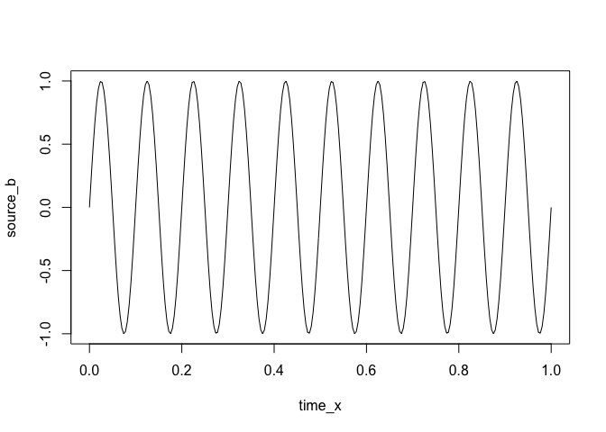

<!-- README.md is generated from README.Rmd. Please edit that file -->

# infomax

<!-- badges: start -->

[](https://www.tidyverse.org/lifecycle/#experimental)

[](https://github.com/craddm/infomax/actions)
[](https://codecov.io/gh/craddm/infomax)
[](https://github.com/eegverse/infomax/actions/workflows/R-CMD-check.yaml)
<!-- badges: end -->

The `infomax` package is an R implementation of the Infomax and Extended
Infomax algorithms (Bell & Sejnowski, 1995; Makeig, Bell, Jung, &
Sejnowski, 1996) for Independent Component Analysis.

## Installation

The package is not currently released on
[CRAN](https://CRAN.R-project.org).

You can install the development version from
[GitHub](https://github.com/) with:

``` r
# install.packages("remotes")
remotes::install_github("craddm/infomax")
```

## Example

``` r
library(infomax)
## basic example code
```

ICA can be used to separate linear mixtures of different, independent
signal sources.

In the example below, we generate two independent signals and then mix
them together.

``` r
time_x <- seq(0, 1, by = 1/256)
source_a <- sin(2 * pi * 5 * time_x)
source_b <- sin(2 * pi * 10 * time_x)
plot(time_x, source_a, type = "l")
```


``` r
plot(time_x, source_b, type = "l")
```



``` r
plot(time_x, source_a + 2 * source_b, type = "l")
```


``` r
plot(time_x, source_a * 3.4 + 1.5 * source_b, type = "l")
```


The function returns the estimated mixing matrix, unmixing matrix, and
unmixed source timecourses.

``` r
mixed_data <- matrix(NA,
                     nrow = length(time_x),
                     ncol = 2)
mixed_data[, 1] <- source_a + 2 * source_b
mixed_data[, 2] <- source_a * 3.4 + 1.5 * source_b
dat_out <- run_infomax(mixed_data, whiten = "PCA")
#> Removing column means...
#> Step: 1, lrate: 0.007213, wchange: 0.36463661, angledelta:  0.0
#> Step: 2, lrate: 0.007213, wchange: 0.19481550, angledelta:  0.0
#> Step: 3, lrate: 0.007213, wchange: 0.11107675, angledelta: 69.0
#> Step: 4, lrate: 0.007069, wchange: 0.02737449, angledelta: 89.7
#> Step: 5, lrate: 0.006928, wchange: 0.03882114, angledelta: 99.0
#> Step: 6, lrate: 0.006789, wchange: 0.02293030, angledelta: 158.1
#> Step: 7, lrate: 0.006653, wchange: 0.00389497, angledelta: 68.1
#> Step: 8, lrate: 0.006520, wchange: 0.01088580, angledelta: 115.3
#> Step: 9, lrate: 0.006390, wchange: 0.01944029, angledelta: 56.3
#> Step: 10, lrate: 0.006390, wchange: 0.00415085, angledelta: 113.6
#> Step: 11, lrate: 0.006262, wchange: 0.01445681, angledelta: 68.7
#> Step: 12, lrate: 0.006137, wchange: 0.00156026, angledelta: 71.4
#> Step: 13, lrate: 0.006014, wchange: 0.00403134, angledelta: 128.5
#> Step: 14, lrate: 0.005894, wchange: 0.00620306, angledelta: 113.4
#> Step: 15, lrate: 0.005776, wchange: 0.01494067, angledelta: 162.9
#> Step: 16, lrate: 0.005661, wchange: 0.00490534, angledelta: 149.2
#> Step: 17, lrate: 0.005547, wchange: 0.00136619, angledelta: 109.7
#> Step: 18, lrate: 0.005436, wchange: 0.00851935, angledelta: 138.0
#> Step: 19, lrate: 0.005328, wchange: 0.01464675, angledelta: 162.8
#> Step: 20, lrate: 0.005221, wchange: 0.01014882, angledelta: 166.4
#> Step: 21, lrate: 0.005117, wchange: 0.00766760, angledelta: 68.0
#> Step: 22, lrate: 0.005014, wchange: 0.01653765, angledelta: 161.2
#> Step: 23, lrate: 0.004914, wchange: 0.00273984, angledelta: 119.3
#> Step: 24, lrate: 0.004816, wchange: 0.00416888, angledelta: 164.1
#> Step: 25, lrate: 0.004719, wchange: 0.00872817, angledelta: 135.5
#> Step: 26, lrate: 0.004625, wchange: 0.02415541, angledelta: 143.4
#> Step: 27, lrate: 0.004533, wchange: 0.02397406, angledelta: 152.4
#> Step: 28, lrate: 0.004442, wchange: 0.03160373, angledelta: 171.5
#> Step: 29, lrate: 0.004353, wchange: 0.02804221, angledelta: 162.9
#> Step: 30, lrate: 0.004266, wchange: 0.00677975, angledelta: 141.2
#> Step: 31, lrate: 0.004181, wchange: 0.01197310, angledelta: 143.1
#> Step: 32, lrate: 0.004097, wchange: 0.00102980, angledelta: 68.3
#> Step: 33, lrate: 0.004015, wchange: 0.00618413, angledelta: 141.0
#> Step: 34, lrate: 0.003935, wchange: 0.00256564, angledelta: 30.2
#> Step: 35, lrate: 0.003935, wchange: 0.00806613, angledelta: 131.6
#> Step: 36, lrate: 0.003856, wchange: 0.00424036, angledelta: 59.0
#> Step: 37, lrate: 0.003856, wchange: 0.00994809, angledelta: 147.1
#> Step: 38, lrate: 0.003779, wchange: 0.00376290, angledelta: 167.4
#> Step: 39, lrate: 0.003703, wchange: 0.00565847, angledelta: 169.9
#> Step: 40, lrate: 0.003629, wchange: 0.01081492, angledelta: 165.8
#> Step: 41, lrate: 0.003557, wchange: 0.01030219, angledelta: 131.7
#> Step: 42, lrate: 0.003486, wchange: 0.00282292, angledelta: 107.6
#> Step: 43, lrate: 0.003416, wchange: 0.00022858, angledelta: 51.6
#> Step: 44, lrate: 0.003416, wchange: 0.00363687, angledelta: 165.5
#> Step: 45, lrate: 0.003348, wchange: 0.00255131, angledelta: 107.6
#> Step: 46, lrate: 0.003281, wchange: 0.00405222, angledelta: 114.0
#> Step: 47, lrate: 0.003215, wchange: 0.00042604, angledelta: 80.2
#> Step: 48, lrate: 0.003151, wchange: 0.00152613, angledelta: 142.7
#> Step: 49, lrate: 0.003088, wchange: 0.00186418, angledelta: 170.3
#> Step: 50, lrate: 0.003026, wchange: 0.00139700, angledelta: 104.5
#> Step: 51, lrate: 0.002965, wchange: 0.00160308, angledelta: 159.4
#> Step: 52, lrate: 0.002906, wchange: 0.00136144, angledelta: 147.3
#> Step: 53, lrate: 0.002848, wchange: 0.00233749, angledelta: 84.5
#> Step: 54, lrate: 0.002791, wchange: 0.00343702, angledelta: 141.5
#> Step: 55, lrate: 0.002735, wchange: 0.00114651, angledelta: 173.1
#> Step: 56, lrate: 0.002681, wchange: 0.00048643, angledelta: 95.8
#> Step: 57, lrate: 0.002627, wchange: 0.00124171, angledelta: 134.5
#> Step: 58, lrate: 0.002574, wchange: 0.00081969, angledelta: 87.5
#> Step: 59, lrate: 0.002523, wchange: 0.00318217, angledelta: 121.8
#> Step: 60, lrate: 0.002472, wchange: 0.00240331, angledelta: 162.7
#> Step: 61, lrate: 0.002423, wchange: 0.00277113, angledelta: 104.0
#> Step: 62, lrate: 0.002375, wchange: 0.00085483, angledelta: 56.4
#> Step: 63, lrate: 0.002375, wchange: 0.00116178, angledelta: 124.6
#> Step: 64, lrate: 0.002327, wchange: 0.00042943, angledelta: 116.3
#> Step: 65, lrate: 0.002281, wchange: 0.00083923, angledelta: 57.8
#> Step: 66, lrate: 0.002281, wchange: 0.00142626, angledelta: 97.3
#> Step: 67, lrate: 0.002235, wchange: 0.00030707, angledelta: 134.0
#> Step: 68, lrate: 0.002190, wchange: 0.00038411, angledelta: 174.9
#> Step: 69, lrate: 0.002146, wchange: 0.00108451, angledelta: 137.1
#> Step: 70, lrate: 0.002103, wchange: 0.00138902, angledelta: 130.6
#> Step: 71, lrate: 0.002061, wchange: 0.00042050, angledelta: 106.9
#> Step: 72, lrate: 0.002020, wchange: 0.00059500, angledelta: 123.4
#> Step: 73, lrate: 0.001980, wchange: 0.00049654, angledelta: 153.8
#> Step: 74, lrate: 0.001940, wchange: 0.00006995, angledelta: 29.9
#> Step: 75, lrate: 0.001940, wchange: 0.00040430, angledelta: 103.5
#> Step: 76, lrate: 0.001901, wchange: 0.00060435, angledelta: 152.4
#> Step: 77, lrate: 0.001863, wchange: 0.00010456, angledelta: 35.6
#> Step: 78, lrate: 0.001863, wchange: 0.00061408, angledelta: 79.4
#> Step: 79, lrate: 0.001826, wchange: 0.00065221, angledelta: 149.5
#> Step: 80, lrate: 0.001790, wchange: 0.00029321, angledelta: 157.7
#> Step: 81, lrate: 0.001754, wchange: 0.00016466, angledelta: 152.5
#> Step: 82, lrate: 0.001719, wchange: 0.00021806, angledelta: 135.0
#> Step: 83, lrate: 0.001684, wchange: 0.00093708, angledelta: 125.9
#> Step: 84, lrate: 0.001651, wchange: 0.00001079, angledelta: 96.0
#> Step: 85, lrate: 0.001618, wchange: 0.00017524, angledelta: 64.8
#> Step: 86, lrate: 0.001585, wchange: 0.00017004, angledelta: 150.2
#> Step: 87, lrate: 0.001554, wchange: 0.00028965, angledelta: 28.6
#> Step: 88, lrate: 0.001554, wchange: 0.00010428, angledelta: 118.7
#> Step: 89, lrate: 0.001522, wchange: 0.00004898, angledelta: 97.4
#> Step: 90, lrate: 0.001492, wchange: 0.00075904, angledelta: 53.5
#> Step: 91, lrate: 0.001492, wchange: 0.00094535, angledelta: 132.7
#> Step: 92, lrate: 0.001462, wchange: 0.00038947, angledelta: 123.1
#> Step: 93, lrate: 0.001433, wchange: 0.00028328, angledelta: 148.7
#> Step: 94, lrate: 0.001404, wchange: 0.00011637, angledelta: 58.0
#> Step: 95, lrate: 0.001404, wchange: 0.00031337, angledelta: 147.8
#> Step: 96, lrate: 0.001376, wchange: 0.00003260, angledelta: 84.6
#> Step: 97, lrate: 0.001349, wchange: 0.00020651, angledelta: 127.7
#> Step: 98, lrate: 0.001322, wchange: 0.00012545, angledelta: 37.5
#> Step: 99, lrate: 0.001322, wchange: 0.00015748, angledelta: 160.7
#> Step: 100, lrate: 0.001295, wchange: 0.00002051, angledelta: 109.5
#> Step: 101, lrate: 0.001269, wchange: 0.00021360, angledelta: 69.3
#> Step: 102, lrate: 0.001244, wchange: 0.00007428, angledelta: 128.9
#> Step: 103, lrate: 0.001219, wchange: 0.00029896, angledelta: 88.7
#> Step: 104, lrate: 0.001195, wchange: 0.00013785, angledelta: 108.3
#> Step: 105, lrate: 0.001171, wchange: 0.00006884, angledelta: 60.1
#> Step: 106, lrate: 0.001147, wchange: 0.00046628, angledelta: 123.1
#> Step: 107, lrate: 0.001124, wchange: 0.00005191, angledelta: 105.6
#> Step: 108, lrate: 0.001102, wchange: 0.00006344, angledelta: 52.6
#> Step: 109, lrate: 0.001102, wchange: 0.00008563, angledelta: 159.4
#> Step: 110, lrate: 0.001080, wchange: 0.00004485, angledelta: 47.9
#> Step: 111, lrate: 0.001080, wchange: 0.00006637, angledelta: 98.1
#> Step: 112, lrate: 0.001058, wchange: 0.00005175, angledelta: 135.7
#> Step: 113, lrate: 0.001037, wchange: 0.00003072, angledelta: 144.0
#> Step: 114, lrate: 0.001016, wchange: 0.00000844, angledelta: 45.9
#> Step: 115, lrate: 0.001016, wchange: 0.00020538, angledelta: 132.6
#> Step: 116, lrate: 0.000996, wchange: 0.00003832, angledelta: 123.8
#> Step: 117, lrate: 0.000976, wchange: 0.00005428, angledelta: 109.2
#> Step: 118, lrate: 0.000957, wchange: 0.00008853, angledelta: 57.6
#> Step: 119, lrate: 0.000957, wchange: 0.00005420, angledelta: 154.1
#> Step: 120, lrate: 0.000938, wchange: 0.00002378, angledelta: 47.6
#> Step: 121, lrate: 0.000938, wchange: 0.00007346, angledelta: 119.8
#> Step: 122, lrate: 0.000919, wchange: 0.00007935, angledelta: 97.0
#> Step: 123, lrate: 0.000900, wchange: 0.00004209, angledelta: 123.7
#> Step: 124, lrate: 0.000882, wchange: 0.00013245, angledelta: 71.1
#> Step: 125, lrate: 0.000865, wchange: 0.00006845, angledelta: 166.8
#> Step: 126, lrate: 0.000847, wchange: 0.00002614, angledelta: 134.3
#> Step: 127, lrate: 0.000830, wchange: 0.00000392, angledelta: 55.4
#> Step: 128, lrate: 0.000830, wchange: 0.00006802, angledelta: 148.4
#> Step: 129, lrate: 0.000814, wchange: 0.00007455, angledelta: 106.8
#> Step: 130, lrate: 0.000798, wchange: 0.00001582, angledelta: 20.3
#> ICA running time: 0.083 s
plot(time_x,
     dat_out$S[,1],
     type = "l")
```


``` r
plot(time_x,
     dat_out$S[,2],
     type = "l")
```


## References

- Bell, A.J., & Sejnowski, T.J. (1995). An information-maximization
  approach to blind separation and blind deconvolution. *Neural
  Computation, 7,* 1129-159
- Makeig, S., Bell, A.J., Jung, T-P and Sejnowski, T.J., “Independent
  component analysis of electroencephalographic data,” In: D.
  Touretzky, M. Mozer and M. Hasselmo (Eds). Advances in Neural
  Information Processing Systems 8:145-151, MIT Press, Cambridge, MA
  (1996).
